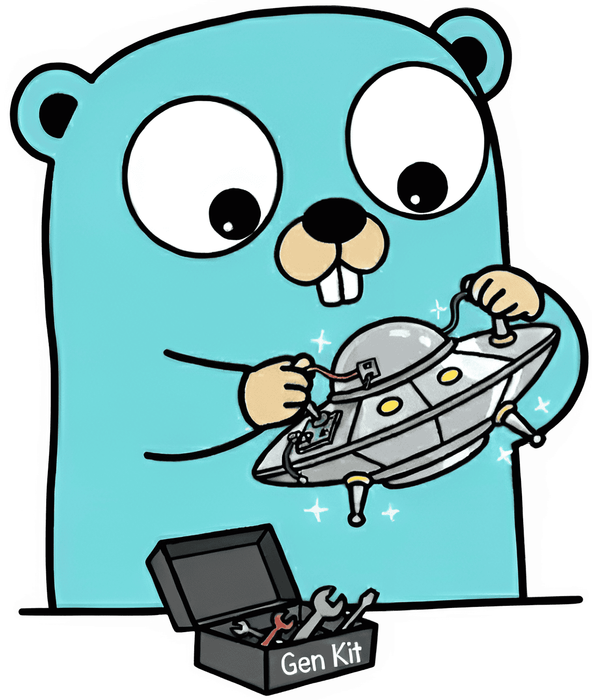

# UFO Gen Kit



<br/>

<p>
  <a href="https://github.com/uforg/ufogenkit/actions">
    
  </a>
  <a href="https://pkg.go.dev/github.com/uforg/ufogenkit">
    
  </a>
  <a href="https://goreportcard.com/report/uforg/ufogenkit">
    
  </a>
  <a href="https://github.com/uforg/ufogenkit/releases/latest">
    
  </a>
  <a href="LICENSE">
    
  </a>
  <a href="https://github.com/uforg/ufogenkit">
    
  </a>
</p>

UFO Gen Kit is a simple and powerful code generation toolkit that provides a fluent interface for generating code in any programming language.

It handles indentation and line breaks automatically, making it easy to generate clean and properly formatted code.

## Features

- Zero dependencies
- Fluent interface for easy code generation
- Customizable indentation (spaces or tabs)
- Block-based code generation
- String formatting support
- Language-agnostic design
- Raw content insertion
- Manual line breaks

## Installation

```bash
go get github.com/uforg/ufogenkit
```

## Usage

### Basic Example

```go
g := ufogenkit.NewGenKit()

g.Line("function greet(name) {")

// Functions can be optionally chained for fluent code generation
g.Indent().
    Line("console.log('Hello, ' + name)").
    Dedent().
    Line("}")

fmt.Println(g.String())
```

Output:

```javascript
function greet(name) {
  console.log("Hello, " + name);
}
```

### Custom Indentation

```go
// Use 4 spaces
g := ufogenkit.NewGenKit().WithSpaces(4)

// Use tabs
g := ufogenkit.NewGenKit().WithTabs()
```

### Block-based Generation

With blocks, you can automatically manage indentation.

```go
g := ufogenkit.NewGenKit()
g.Line("class User {")
g.Block(func() {
    g.Line("constructor(name) {")
    g.Block(func() {
        g.Line("this.name = name")
    })
    g.Line("}")
})
g.Line("}")
```

Output:

```javascript
class User {
  constructor(name) {
    this.name = name;
  }
}
```

### Conditional Lines

```go
isAngry := true
g := ufogenkit.NewGenKit()

g.Line("func saySomething() string {")
g.Block(func() {
	if isAngry {
	    g.Line(`return "I'm angry"`)
    } else {
        g.Line(`return "I'm not angry"`)
    }
})
g.Line("}")
```

Output:

```go
func saySomething() string {
    return "I'm angry"
}
```

### Formatted Lines

```go
g := ufogenkit.NewGenKit()
g.Linef("const %s = %q", "greeting", "Hello, World!")
```

Output:

```javascript
const greeting = "Hello, World!";
```

### Raw Content

```go
g := ufogenkit.NewGenKit()
g.Raw("console.log('Hello, World!');")
```

Output:

```javascript
console.log("Hello, World!");
```

### Manual Line Breaks

```go
g := ufogenkit.NewGenKit()
g.Line("console.log('Hello')").Break().Line("console.log('World')")
```

Output:

```javascript
console.log("Hello");

console.log("World");
```

### Inline Content

```go
g := ufogenkit.NewGenKit()
g.Inline("console.log('Hello')").Inline("console.log('World')")
```

Output:

```javascript
console.log('Hello')console.log('World')
```

### Generating the Code

```go
g := ufogenkit.NewGenKit()
g.Line("package main")

result := g.String()
```

## Examples

### TypeScript Interface

```go
g := ufogenkit.NewGenKit()
g.Line("interface User {").
    Indent().
    Line("id: string").
    Line("name: string").
    Line("age: number").
    Dedent().
    Line("}")
```

### Python Class

```go
g := ufogenkit.NewGenKit().WithSpaces(4)
g.Line("class User:").
    Indent().
    Line("def __init__(self, name, age):").
    Indent().
    Line("self.name = name").
    Line("self.age = age").
    Dedent().
    Line("").
    Line("def greet(self):").
    Indent().
    Line("return f\"Hello, {self.name}!\"").
    Dedent()
```

### Go Struct

```go
g := ufogenkit.NewGenKit()
g.Line("type User struct {").
    Indent().
    Line("ID   int").
    Line("Name string").
    Dedent().
    Line("}")
```
